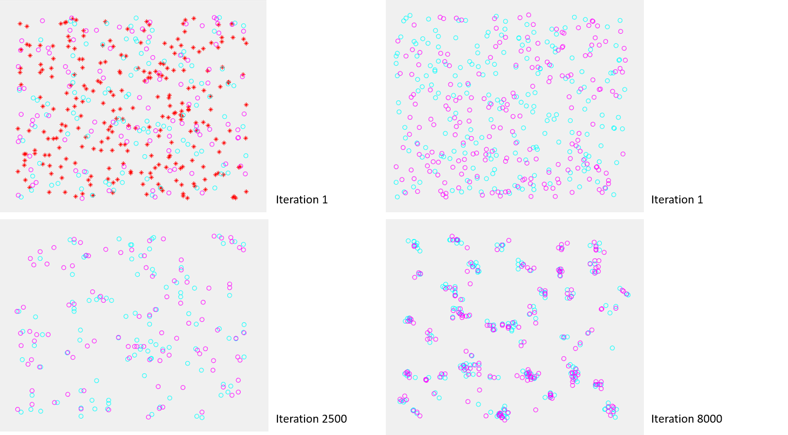

# ACOC
Ant Colony Optimized Clustering Algorithm

Ants constructs a solution by assigning a data point to a cluster. The desirability of assigning a data point to a cluster is represented by the amount of pheromone. Mimic ants’ gathering/sorting activities. Ant-based approach takes advantage of emergent behavior of the ants.

# Simulation Results

